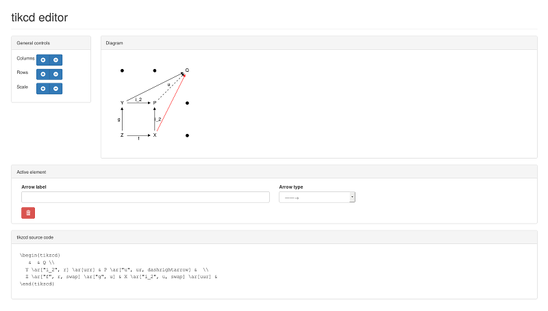

# tikzcdedit

The package [tikzcd](https://www.ctan.org/pkg/tikz-cd) is an amazing set
of macros and styles to leverage the power of
[tikz/pgf](https://www.ctan.org/pkg/pgf) to produce commutative
diagrams for LaTeX documents. Although this is arguably the most
efficient way to type such diagrams today, it is still tiresome to put
all nodes at their correct place in the node matrix, and to type the
correct combination of moves r/l/u/d for each arrow on the first try.

This small javascript app aims to remedy this, and allows to very quickly
type simple diagrams or get the skeleton of complicated ones. It relies
the awesome [VueJS](http://vuejs.org/) framework to do all
the data-binding work and [bootstrap3](http://getbootstrap.com/) to make
the interface look nice.

## Install

You can directly use the [online version](https://patrickmassot.github.io/tikzcdedit/).

If you want to host this app, put all three files ``tikzcdedit.*`` in
the same directory and open ``tikzcdedit.html`` in a modern web
browser, either from a local disk or through a web server.

If you want to be able to use this tool without an internet connection
then, in addition to the aforementioned three files, you need to
download [bootstrap3](http://getbootstrap.com/) and
[VueJS](http://vuejs.org/) and replace the external links in
``tikzcdedit.html`` with links pointing towards your local copy.

## Use

Left-click on a dot and type some TeX (without enclosing ``$`` or
``\(``/``\)``) to turn it into an object of your commutative diagram.
Control-left-click another node to create an arrow between these nodes.
Type an arrow label, choose an arrow type and swap label if needed.

When done, copy and paste the produced TeX code into your TeX file.
